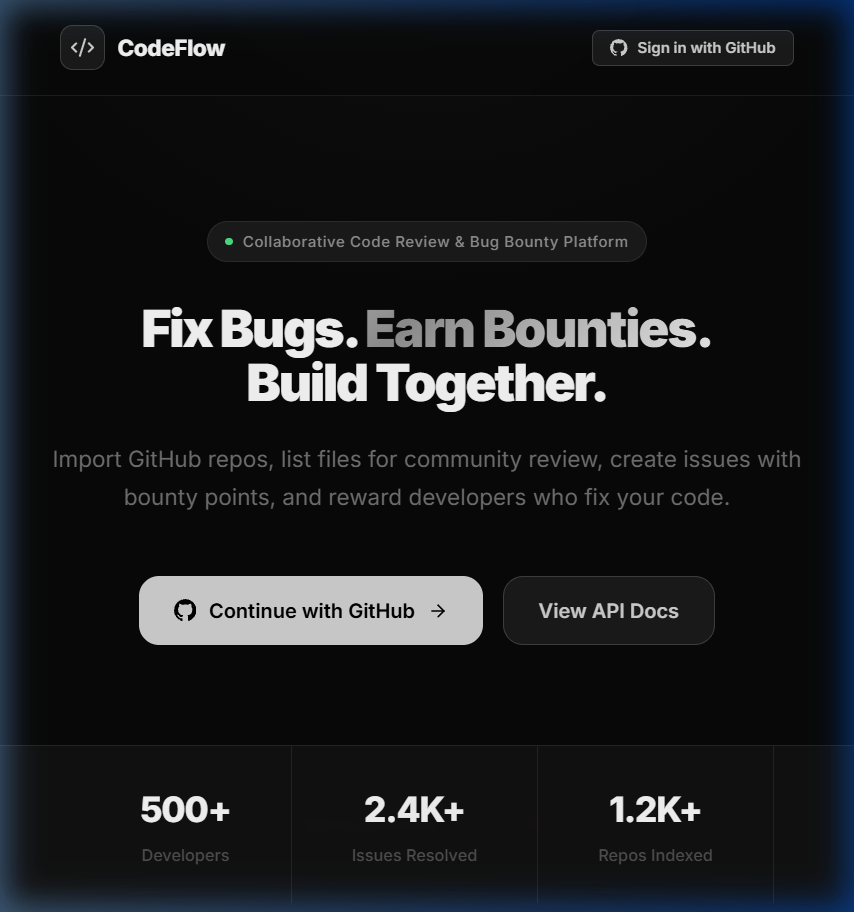

# CodeFlow 🚀

A collaborative, gamified code review and bug bounty platform.

CodeFlow allows open-source maintainers to post issues with bounties, and rewards developers for submitting verified solutions. With integrated AI code review, reputation streaks, and a unique issue bidding system, CodeFlow makes open-source collaboration fun, rewarding, and efficient.


## ✨ Key Features

1. **🤖 Automated AI Code Review**
   As soon as a developer submits a code patch, an integrated AI (powered by OpenRouter) immediately analyzes the code and posts a beautifully styled code review comment. It highlights bugs, security flaws, and praises good code before a maintainer even has to look at it!

2. **💰 Issue Bidding System**
   Solvers can name their price! When submitting a solution, developers can specify a custom bid (requested points) from the issue's available bounty pool. If the maintainer accepts the solution, the solver is awarded exactly what they asked for.

3. **🔥 Streaks & Daily Challenges**
   Logging in and being active on consecutive days builds a user's streak. Maintaining a streak awards bonus reputation points every single day, encouraging developers to return and contribute regularly.

4. **🚀 Bounty Pooling (Crowdfunding)**
   Is there a bug you really want fixed? Anyone can click the **Boost Bounty** button on an open issue to pledge their own hard-earned reputation points into the issue's bounty pool, incentivizing others to fix it faster.

5. **🏆 Verifiable Developer Portfolios**
   Every user has a public profile page displaying their active streak, total reputation points, and a verified portfolio of every bug they've successfully solved across the platform. 



## 📁 Project Structure

This is a monorepo setup containing:
- `backend/` - The FastAPI backend (MongoDB, Redis, JWT auth).
- `frontend/` - The Vite + React + TypeScript frontend.

## 🚀 Getting Started

### 1. Backend Setup

1. Navigate to the backend directory:
   ```bash
   cd backend
   ```
2. Install dependencies:
   ```bash
   pip install -r requirements.txt
   ```
3. Configure your environment variables in `backend/.env`. Specifically, you will need to add an OpenRouter API key for the AI code review:
   ```env
   OPENROUTER_API_KEY=your-api-key-here
   ```
4. Start the API server:
   ```bash
   python -m uvicorn app.main:app --reload
   ```

### 2. Frontend Setup

1. Navigate to the frontend directory:
   ```bash
   cd frontend
   ```
2. Install dependencies:
   ```bash
   npm install
   ```
3. Start the development server:
   ```bash
   npm run dev
   ```

Go to **http://localhost:5173** to view the app!

## 🧪 Technologies Used

- **Frontend:** React, Vite, TypeScript, Lucide Icons
- **Backend:** FastAPI, Python, Beanie (MongoDB ODM)
- **Database:** MongoDB
- **Caching & Tasks:** Redis, BackgroundTasks
- **AI Integration:** OpenRouter (LLMs)
